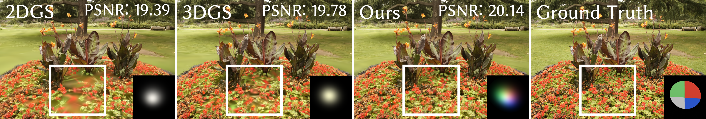

# SuperGaussians: Enhancing Gaussian Splatting Using Primitives with Spatially Varying Colors



[[Project]](https://ruixu.me/html/SuperGaussians/index.html) [[Arxiv]](http://arxiv.org/abs/2411.18966)
Gaussian Splattings demonstrate impressive results in multi-view reconstruction based on Gaussian explicit representations. However, the current Gaussian primitives only have a single view-dependent color and an opacity to represent the appearance and geometry of the scene, resulting in a non-compact representation. In this paper, we introduce a new method called SuperGaussians that utilizes spatially varying colors and opacity in a single Gaussian primitive to improve its representation ability. We have implemented bilinear interpolation, movable kernels, and even tiny neural networks as spatially varying functions. Quantitative and qualitative experimental results demonstrate that all three functions outperform the baseline, with the best movable kernels achieving superior novel view synthesis performance on multiple datasets, highlighting the strong potential of spatially varying functions. Our code will be available upon acceptance.


## Installation

```bash
# download
git clone

# if you have an environment used for 3dgs, use it
# if not, create a new environment
conda env create --file environment.yml
conda activate SuperGaussians
```
## Training
To train a scene, simply use
```bash
python train.py -s <path to COLMAP or NeRF Synthetic dataset>
```


## Testing
### Bounded Mesh Extraction

```bash
python render.py -m <path to pre-trained model> -s <path to COLMAP dataset> 
```


### Quick Examples
Assuming you have downloaded [MipNeRF360], simply use
```bash
python train.py -s <path to m360>/<garden> -m output/m360/garden
# use our unbounded mesh extraction!!
python render.py -s <path to m360>/<garden> -m output/m360/garden --unbounded --skip_mesh --skip_train 


**Custom Dataset**: We use the same COLMAP loader as 3DGS, you can prepare your data following 3DGS.


#### Novel View Synthesis
For novel view synthesis on [MipNeRF360] (which also works for other colmap datasets), use
```bash
python scripts/mipnerf_eval.py -m360 <path to the MipNeRF360 dataset>
```

